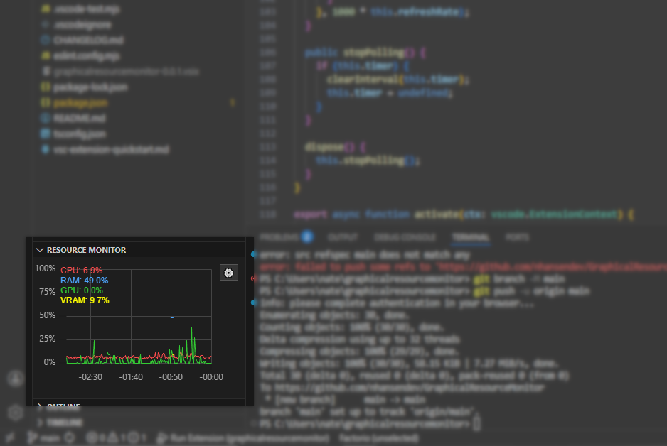
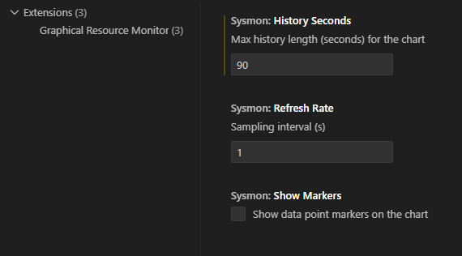

# Graphical Resource Monitor
#### VS Code Extension

- A lightweight system resource monitor extension for VS Code
- Adds a window on the Explorer tab containing a continuously scrolling graph of resource usage
- Shows CPU, RAM, GPU, and VRAM usage as a percentage of system total
- Dynamically resizable
- Configurable for different time-frames, sample rates, and plot formatting

**Note:** Only tested on Windows 10, with an Nvidia GPU. Reduced functionality for other OS/GPU types is likely until support is explicitly added.

### Configuration Options
Click the gear icon in the top-right of the monitor window, or search for "sysmon" in the settings:
(more to be added)
